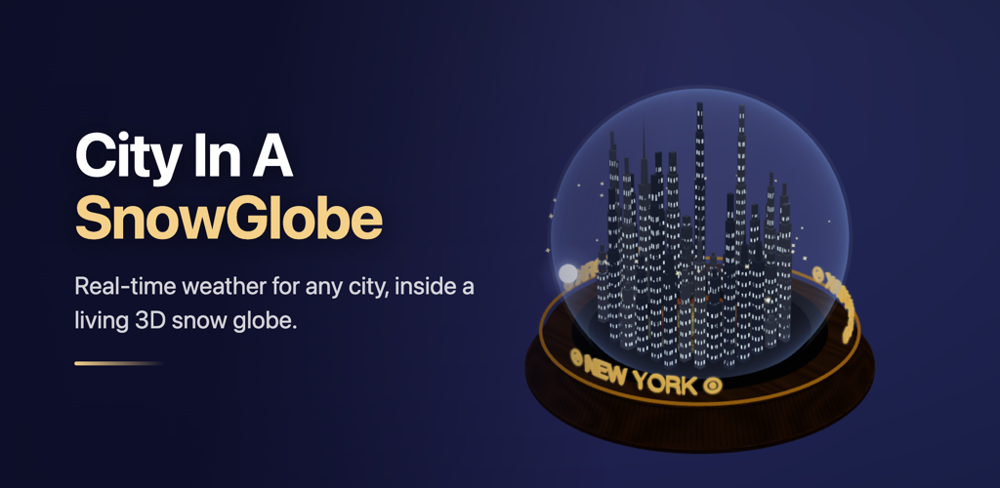

# City In A Snowglobe



A city inside a snow globe, under its own live weather and sky. Built with React, React Three Fiber, and @react-three/xr, with weather from OpenWeatherMap.

Live at [city-in-a-snowglobe.com](https://www.city-in-a-snowglobe.com).

## What it does

**The globe.** A procedural city on a reeded wooden plinth, under glass, with a forged gold ring and the city name in extruded lettering. Buildings, bridges, benches, a fountain, and a park laid out around it.

**Live weather.** Current conditions, an hourly trend, and a day by day forecast. Everything in the scene follows it: cloud cover, rain, snow, thunder, fog, and how the glass is tinted.

**A real sky.** The sun and moon sit where they actually are for the city and the date, using NOAA solar and lunar positions. Night brings out stars.

**Seasons.** The park changes with the city's own date and hemisphere. Bare trees in winter, blossom in spring, green in summer, and turning leaves in autumn, with petals or leaves falling and settling on the grass.

**Snow that rests.** Snow lands and stays on the ground, on trees, on bushes, and on rooftops instead of falling through them.

**Shake it.** A button, or a shake of the phone, tumbles the globe and throws the snow up.

**3D and AR.** The default 3D canvas, plus AR where the device supports it. Android and Android XR use WebXR, iOS hands off to AR Quick Look, and anything else falls back to a camera view.

## Running it locally

You need an OpenWeatherMap API key. Sign up at [openweathermap.org/api](https://openweathermap.org/api) and generate one. It can take a few minutes to activate.

```bash
npm install
```

Create a `.env` file in the root and add your key:

```
OPENWEATHER_API_KEY=your_key_here
```

Then start it:

```bash
npm run dev
```

The app runs at `http://localhost:3000`.

The key is server side only. It never reaches the browser. Requests go through `/api/openweather`, which is a Vercel function in production and Vite middleware in development, and that is the only place the key is read.

## Using it

Tap **Open Weather Info** for the panel. Search a city, switch between Minimal, Compact, and Informational layouts, and drag the Sun and Moon slider to move the sky through the day. The clock above the globe follows the slider, and **Reset to Current Time** puts it back.

Outside the panel, drag to rotate, right drag to pan, and scroll or pinch to zoom.

The panel also has toggles that force thunder, snow, or rain, which are there for checking the effects without waiting for the weather.

## Deploying

The site runs on Vercel.

1. Push to GitHub and import the repository in Vercel.
2. Add `OPENWEATHER_API_KEY` under Project Settings, Environment Variables.
3. Deploy.

`vercel.json` is already set up for Vite. There is no rewrite rule, so unknown paths return a real 404 from `public/404.html` instead of the app.

For ads, add `VITE_ADSENSE_SLOT_DRAWER` and `VITE_ADSENSE_SLOT_FOOTER`. Slots with no id render nothing, so it is safe to deploy before the ad units exist. See [docs/monetization.md](docs/monetization.md).

## Building

```bash
npm run build      # production build into dist/
npm run preview    # serve that build
npm test           # the Playwright suite
```

Android, which needs the Capacitor setup:

```bash
npm run android:sync     # build and sync to the Android project
npm run android:open     # open it in Android Studio
npm run android:build    # release APK
npm run android:bundle   # release AAB for Play
```

The Android scripts set `SNOWGLOBE_PLATFORM=native`, which keeps the AdSense loader out of the app. AdSense is a website product and using it inside a packaged app breaks its policies.

## Store artwork

Everything in `assets/play-store/` is captured from the running app, so the artwork is the real globe rather than a mockup:

```bash
npm run dev                # must be running
npm run store:screenshots  # every device set
npm run store:brand        # icon and feature graphic sources
```

See [assets/play-store/README.md](assets/play-store/README.md) for what goes where in the Play Console.

## Project layout

```
src/
  components/
    City.jsx               the city, park, paths, and landmarks
    SnowGlobe.jsx          plinth, glass, gold ring, 3D lettering
    WeatherEffects.jsx     rain, snow, thunder, clouds, stars
    WeatherDrawer.jsx      the side panel shell
    WeatherUI.jsx          panel content, graphs, metrics, search
    CityClock.jsx          the time and date above the globe
    LoadingScreen.jsx      the cover shown while the sky loads
    city/, environment/    fountain, vegetation, sun and moon
    ads/AdSlot.jsx         one ad position, web or native
  services/
    WeatherService.js      the weather API, with a 15 minute cache
    ads/                   which ad network fills a slot
  utils/
    celestialPosition.js   where the sun and moon actually are
    seasons.js             season by date, hemisphere, and latitude
    parkLayout.js          the park's paved surfaces and planting rule
    surfaceHeightField.js  what the snow lands on
api/
  openweather.mjs          the proxy that holds the key
  weather.js              a city shaped route over the same proxy
tests/e2e/                 the Playwright suite
docs/                      Android, iOS AR, and monetization guides
```

## Platform support

**Web.** Any modern browser with WebGL 2. Desktop and mobile.

**AR.** Android and Android XR through WebXR in Chrome. iOS 17 and up through AR Quick Look, which needs no WebXR. Everything else gets the camera fallback. All of them need camera permission, and a physical device, since simulators do not do AR.

**Android app.** Full support through Capacitor. See [docs/android/README.md](docs/android/README.md).

## Tests

```bash
npm test                 # the whole suite
npm run test:ui          # the Playwright UI
npm run test:report      # the last HTML report
```

The suite runs against a real dev server with the weather stubbed, one worker at a time, because every test renders a full WebGL scene and running them in parallel starves the GPU. Expect it to take a while.

## Troubleshooting

**The key does not work.** A new key can take 10 to 20 minutes to activate. Check for stray spaces. The key belongs in `.env` as `OPENWEATHER_API_KEY`, not in any `VITE_` variable, since anything prefixed `VITE_` is shipped to the browser.

**The scene does not load.** Check that the browser supports WebGL 2, and look in the console. Chrome, Firefox, and Edge are the safe ones.

**AR is not available.** The button disables itself when the device cannot do it. On iOS you need 17 or later. On Android you need a WebXR browser. Either way you need camera permission and a real device.

**A city is not found.** Try adding the country code, like "London, GB", or use the larger city nearby.

## License

MIT. Use it however you like.

## Credits

Weather from OpenWeatherMap. Built on Three.js and React Three Fiber. Weather icons from [@bybas/weather-icons](https://github.com/basmilius/weather-icons).
